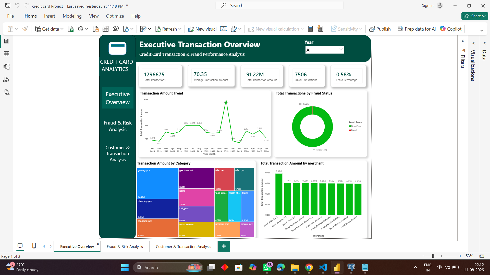
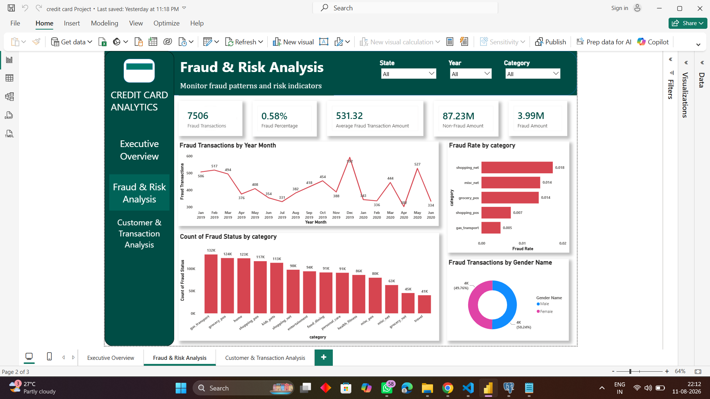
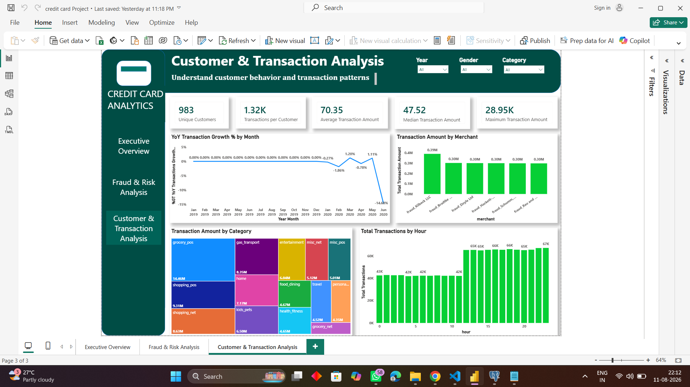

# Credit Card Transaction Analysis

An end-to-end Data Analytics project analyzing credit card transactions, customer behavior, transaction patterns, merchant activity, and fraudulent transactions using Python, PostgreSQL, and Power BI.

---

## 📌 Project Overview

This project analyzes a large-scale credit card transaction dataset to understand transaction behavior, spending patterns, customer activity, merchant performance, and fraud patterns.

The project follows an end-to-end Data Analytics workflow:

**Raw Data → Python Data Cleaning & Feature Engineering → Exploratory Data Analysis → PostgreSQL Analysis → Power BI Report → Business Insights**

The final solution consists of a three-page interactive Power BI report designed to provide both high-level business performance and detailed fraud/customer analysis.

---

## 🎯 Business Objectives

The main objectives of this project are:

- Analyze overall credit card transaction performance
- Understand transaction amount and spending patterns
- Identify high-performing transaction categories
- Analyze merchant-level transaction activity
- Understand customer transaction behavior
- Identify fraudulent transactions
- Calculate fraud rates and analyze fraud patterns
- Analyze transaction and fraud activity across time
- Build interactive Power BI reports for business stakeholders
- Generate actionable business insights and recommendations

---

## 📊 Dataset Overview

The original dataset contains:

| Metric | Value |
|---|---:|
| Total Records | **1,296,675** |
| Original Columns | **24** |
| Processed Columns | **29** |
| Domain | Credit Card Transactions |

The original dataset contains transaction, customer, merchant, geographic, demographic, and fraud-related information.

During Python data preparation and feature engineering, additional analytical columns were created, resulting in a processed dataset containing **29 columns**.

### Major Data Categories

- Transaction details
- Customer information
- Merchant information
- Transaction categories
- Geographic information
- Customer demographics
- Fraud indicators
- Date and time attributes

---

## 🛠️ Tools & Technologies

### Python

- Python
- Pandas
- NumPy
- Matplotlib
- Seaborn
- Data Cleaning
- Feature Engineering
- Exploratory Data Analysis
- Data Visualization

### PostgreSQL

- PostgreSQL
- pgAdmin
- SQL
- Aggregations
- GROUP BY
- HAVING
- JOINs
- CASE WHEN
- CTEs
- Subqueries
- Window Functions
- Business-oriented SQL analysis

### Power BI

- Power Query
- Data Transformation
- Data Modeling
- DAX
- KPI Cards
- Interactive Visualizations
- Slicers
- Filters
- Page Navigation
- Dashboard/Report Design
- Business Insights

---

# 🔄 Project Workflow

## 1. Data Cleaning & Preparation

Python was used to load and prepare the raw credit card transaction dataset.

The data preparation process included:

- Loading the raw dataset
- Inspecting dataset structure
- Checking missing values
- Checking duplicate records
- Removing unnecessary columns
- Converting date/time columns into appropriate formats
- Creating analytical date and time features
- Exporting the processed dataset for further analysis

### Feature Engineering

Additional analytical fields were created from the transaction timestamp, including:

- Year
- Month
- Month Name
- Day
- Day Name
- Hour

These features were later used for time-based analysis and Power BI visualizations.

---

## 2. Exploratory Data Analysis

Python was used to perform exploratory analysis of the transaction dataset.

The analysis covered:

### Transaction Analysis

- Total number of transactions
- Total transaction amount
- Average transaction amount
- Minimum transaction amount
- Maximum transaction amount
- Transactions by category
- Transaction amount by category
- Average transaction amount by category

### Fraud Analysis

- Total fraud transactions
- Genuine transactions
- Overall fraud rate
- Fraud transactions by category
- Fraud rate by category
- Fraud transactions by month
- Fraud rate by month
- Fraud transactions by day
- Fraud transactions by hour

### Time-Based Analysis

- Transactions by year
- Transactions by month
- Transactions by day of week
- Transactions by hour

---

## 3. PostgreSQL Analysis

PostgreSQL was used to perform structured business analysis on the transaction data.

The SQL analysis covers:

- Overall transaction KPIs
- Fraud analysis
- Customer analysis
- Category analysis
- Merchant analysis
- Transaction trends
- Aggregations
- Ranking and analytical queries
- Business-focused analysis

The complete SQL analysis is available in:

`SQL/Credit_Card_Transaction_Analysis.sql`

---

# 📈 Power BI Report

The final Power BI solution contains **three interactive report pages**.

---

## 1️⃣ Executive Overview

Provides a high-level overview of credit card transaction performance.

### Key KPIs

- **Total Transactions:** 1,296,675
- **Total Transaction Amount:** 91.22M
- **Average Transaction Amount:** 70.35
- **Fraud Transactions:** 7,506
- **Fraud Percentage:** 0.58%

### Analysis Includes

- Transaction trends
- Transaction amount analysis
- Category analysis
- Merchant analysis
- Fraud status comparison
- Interactive slicers



---

## 2️⃣ Fraud & Risk Analysis

Focuses on identifying and understanding fraudulent transaction patterns.

### Key KPIs

- **Fraud Transactions:** 7,506
- **Fraud Percentage:** 0.58%
- **Average Fraud Transaction Amount:** 531.32
- **Non-Fraud Transaction Amount:** 87.23M
- **Fraud Transaction Amount:** 3.99M

### Analysis Includes

- Fraud trends
- Fraud rate by category
- Fraud transactions by category
- Fraud analysis by gender
- Time-based fraud analysis
- Interactive fraud-related slicers



---

## 3️⃣ Customer & Transaction Analysis

Focuses on customer transaction behavior and detailed transaction patterns.

### Key KPIs

- **Unique Customers:** 983
- **Transactions per Customer:** 1.32K
- **Average Transaction Amount:** 70.35
- **Median Transaction Amount:** 47.52
- **Maximum Transaction Amount:** 28.95K

### Analysis Includes

- Year-over-Year transaction analysis
- Transaction amount by category
- Merchant transaction analysis
- Transactions by hour
- Customer and transaction behavior
- Interactive slicers



---

# 💡 Key Insights

The analysis provides several important observations:

- The dataset contains more than **1.29 million credit card transactions**.
- Fraud transactions represent approximately **0.58% of total transactions**.
- Fraudulent transactions have a substantially higher average transaction amount than the overall average transaction.
- Transaction activity varies across categories and merchants.
- Transaction volume changes throughout different hours of the day.
- Fraud rates differ across transaction categories.
- Time-based analysis helps identify periods with higher transaction and fraud activity.
- Merchant and category analysis helps identify areas requiring closer monitoring.

---

# 📌 Business Recommendations

Based on the analysis, the following actions can be considered:

1. **Strengthen monitoring of high-value transactions** because fraudulent transactions show a significantly higher average transaction amount.

2. **Prioritize high-risk transaction categories** by applying additional fraud monitoring rules where fraud rates are comparatively higher.

3. **Monitor merchant-level transaction patterns** to identify unusual transaction activity.

4. **Use time-based fraud monitoring** to identify unusual activity during specific hours or periods.

5. **Monitor customer transaction behavior** to identify abnormal spending patterns.

6. **Use interactive Power BI reporting** to provide stakeholders with an easy way to monitor transaction and fraud KPIs.

---

# 📁 Project Structure

```text
Credit-Card-Transaction-Analysis/
│
├── Dataset/
│
├── Python/
│   ├── eda.py
│   ├── project.py
│   └── visualization.py
│
├── SQL/
│   └── Credit_Card_Transaction_Analysis.sql
│
├── PowerBI/
│
├── Screenshots/
│   ├── Executive_Overview.png
│   ├── Fraud_Risk_Analysis.png
│   └── Customer_Transaction_Analysis.png
│
└── README.md


---

## 👨‍💻 Author

**Ajith Sriramoju**

Aspiring Data Analyst | Python | SQL | Power BI | Excel

- GitHub: [Ajith Sriramoju](https://github.com/AjithSriramoju)
- LinkedIn: [Ajith Sriramoju](https://www.linkedin.com/in/sriramojuajith/)
